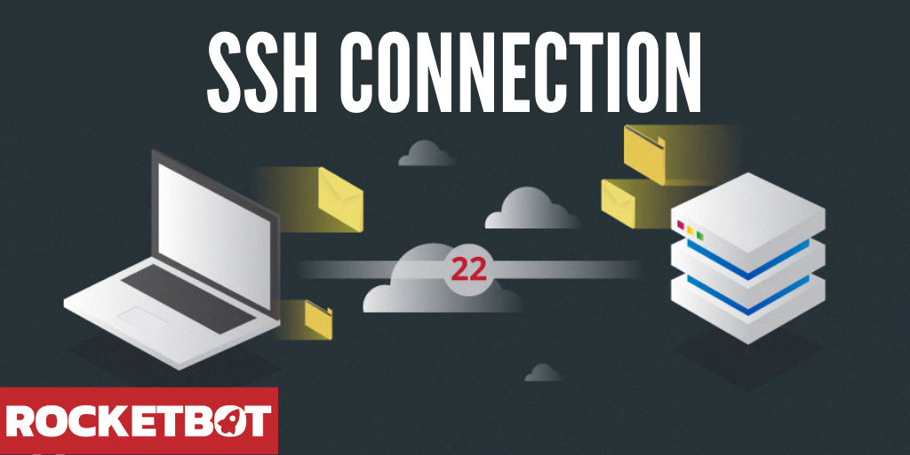

# Conexión SSH
  
Módulo que te permite conectarte a una máquina remota por SSH, tanto por usuario y contraseña como por archivo PEM.
  

## Como instalar este módulo
  
__Descarga__ e __instala__ el contenido en la carpeta 'modules' en la ruta de rocketbot.  

## Descripción de los comandos

### Conectar con pem
  
Conexión SSH con un archivo pem
|Parámetros|Descripción|ejemplo|
| --- | --- | --- |
|Ingrese ruta del archivo pem|Ruta del archivo pem para la conexión ssh|/ruta/del/archivo.pem|
|Ingrese usuario|Nombre del usuario para la conexión ssh|user|
|Contraseña|Contraseña del usuario seleccionado|******|
|Ingrese host|Host de la conexión|1.222.33.456|
|Asignar resultado a variable|Variable donde guardar el resultado|Variable|
|Ingrese nombre de la conexion|Nombre de la conexion de SSH|conn1|

### Crear carpeta
  
Crea una carpeta a traves de SSH
|Parámetros|Descripción|ejemplo|
| --- | --- | --- |
|Ingrese nombre de la carpeta|Nombre usado para crear la carpeta|nombreDeLaCarpeta|
|Ingrese nombre de la conexion|Nombre de la conexion de SSH|conn1|

### Cambiar directorio
  
Cambia la ruta donde se encuentra actualmente trabajando
|Parámetros|Descripción|ejemplo|
| --- | --- | --- |
|Ingrese ruta del directorio|Ruta que se desea ir|/home/|
|Ingrese nombre de la conexion|Nombre de la conexion de SSH|conn1|

### Ejecutar comando
  
Ejecuta un comando con argumentos
|Parámetros|Descripción|ejemplo|
| --- | --- | --- |
|Comando a ejecutar|Comando que desea ejecutar|['ls', '-a']|
|Asignar resultado a variable|Variable donde guardar el resultado|Variable|
|Ingrese nombre de la conexion|Nombre de la conexion de SSH|conn1|

### Escribir en archivo
  
Ejecuta un comando con argumentos
|Parámetros|Descripción|ejemplo|
| --- | --- | --- |
|Ruta del archivo a escribir|Ruta hacia el archivo que se desea escribir|/home/file.txt|
|Texto a escribir|Texto que deseas|Texto de ejemplo|
|Ingrese nombre de la conexion|Nombre de la conexion de SSH|conn1|

### Leer un archivo
  
Leer un archivo a traves de SSH
|Parámetros|Descripción|ejemplo|
| --- | --- | --- |
|Ruta del archivo a leer|Ruta hacia el archivo que se desea leer|/home/file.txt|
|Asignar resultado a variable|Variable donde guardar el resultado|Variable|
|Ingrese nombre de la conexion|Nombre de la conexion de SSH|conn1|

### Cerrar la conexion
  
Cierra la conexion por SSH
|Parámetros|Descripción|ejemplo|
| --- | --- | --- |
|Ingrese nombre de la conexion|Nombre de la conexion de SSH|conn1|
